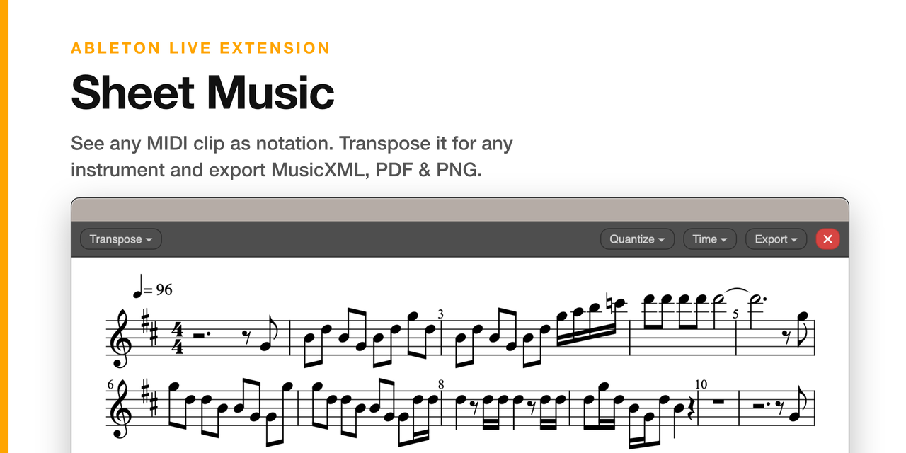
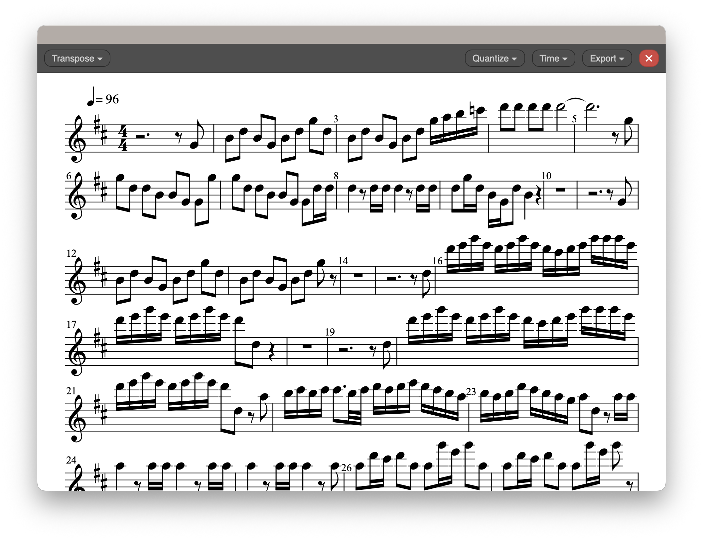

# Ableton Sheet Music Extension

[](https://github.com/madisonrickert/ableton-sheet-music-extension/actions/workflows/ci.yml)
[](https://github.com/madisonrickert/ableton-sheet-music-extension/releases/latest)
[](LICENSE)
[](https://www.ableton.com/en/live/extensions)
[](https://github.com/madisonrickert/ableton-sheet-music-extension/stargazers)

View any MIDI clip in Ableton Live as readable sheet music. Transpose it for any instrument and export **MusicXML**, **PDF**, or **PNG**.



> [!TIP]
> Looking for a tool to convert MIDI to tablature? Check out [AbleTab](https://github.com/madisonrickert/abletab).

## Features

- **Notation view**: renders a selected MIDI clip as sheet music with [OpenSheetMusicDisplay](https://opensheetmusicdisplay.org/).
- **Transposition**: choose an instrument preset (Concert / C, plus Bb, Eb, and F instruments like trumpet, sax, and horn) or transpose by any number of semitones. The key signature follows automatically.
- **Smart staff & clef**: auto-detects treble, bass, or a two-staff **grand staff** for piano-range material; override from the Transpose menu.
- **Smart quantize**: auto-detects the best grid (1/4–1/32) from the clip; override anytime.
- **Time-signature override**: defaults to 4/4 (the SDK does not expose the project's global signature); set it manually when needed.
- **Export**: vector **PDF**, **PNG**, and **MusicXML** (opens cleanly in MuseScore / Dorico). Exports are written to the extension's storage folder and revealed in Finder.
- **Editing**: delegated to Live's piano roll. Adjust notes there, then re-open the chart to refresh.

## How it works

- A right-click action on a MIDI clip reads the clip's notes and opens a modal webview.
- Pure, unit-tested TypeScript modules convert notes → MusicXML: quantization, chord grouping, ties across barlines, instrument transposition, key signatures, and grand-staff splitting.
- The webview renders the MusicXML with OpenSheetMusicDisplay (SVG backend) and produces its exports (vector PDF, PNG, and MusicXML) entirely client-side.
- The Node extension writes the returned file to its sandboxed storage directory and reveals it in Finder.

The notation core (`src/notation/`) has no dependency on the SDK or the DOM, so it is fully unit-testable.



## Install

Download the latest **`.ablx`** from the [**Releases** page](https://github.com/madisonrickert/ableton-sheet-music-extension/releases/latest), then:

1. In Ableton Live, open **Preferences → Extensions** (with Developer Mode **off**, so Live manages the extension).
2. Drag the `.ablx` onto that page.
3. Right-click any MIDI clip → **Extensions → Show Chart**.

Requires **Ableton Live Suite 12.4.5 or newer with Extensions** (currently in the Live 12.4.5 beta; tested on 12.4.5b3). The `.ablx` is self-contained and runs inside Live's Extension Host, so you do **not** need Node.js or the SDK installed to use it. Prefer to build it yourself? See [Build from source](#build-from-source).

## Build from source

This project depends on the Ableton Extensions SDK, which is not published to npm and is not bundled here. Obtain it from Ableton, then:

1. Download and unpack the Extensions SDK (e.g. `extensions-sdk-1.0.0-beta.0`).
2. Tell the project where it is and install:
   ```bash
   cp .env.example .env
   # set ABLETON_SDK_PATH to your unpacked SDK, e.g. /path/to/extensions-sdk-1.0.0-beta.0
   npm run setup
   ```
   `npm run setup` copies the SDK tarballs into `./vendor/` (git-ignored) and installs all dependencies. Set the path once and you never edit `package.json`.

Building from source needs **Node.js ≥ 24** and the **Ableton Extensions SDK (beta)**, distributed by Ableton and **not** included in this repository.

## Develop

The fastest loop uses Live's Developer Mode and an externally-launched Extension Host:

1. In your `.env` (created during setup), set **`EXTENSION_HOST_PATH`** to your Live application, e.g. `/Applications/Ableton Live 12 Suite.app`.
2. In Live: **Preferences → Extensions → enable Developer Mode**.
3. Build and launch the host (leave it running):
   ```bash
   npm start
   ```
4. Right-click a MIDI clip → **Extensions → Show Chart**.

## Build & package

```bash
npm run build               # production bundle → dist/extension.js
npm run package             # build + package the installable → release/Sheet-Music-<version>.ablx
npm run package -- --reveal # same, then reveal the .ablx in Finder (macOS)
```

`npm run package` writes the installable to `release/` (git-ignored), clearing any older `.ablx` first so there's only ever the current one. Install it by dropping the `.ablx` onto Live's **Extensions** preferences (with Developer Mode **off**, so Live manages the host).

## Test

```bash
npm test           # unit tests (vitest)
npm run typecheck  # type-check the extension and the webview
```

## Other extensions by the developer

- [AbleTab](https://github.com/madisonrickert/abletab): View any Ableton Live MIDI clip as tablature for guitar, bass, and others
- [AbleVSEP](https://github.com/madisonrickert/ablevsep): Separate any audio clip into stems with any of MVSEP's 100+ models, right inside Ableton Live 
